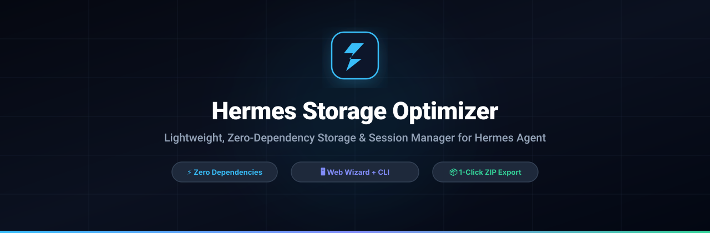
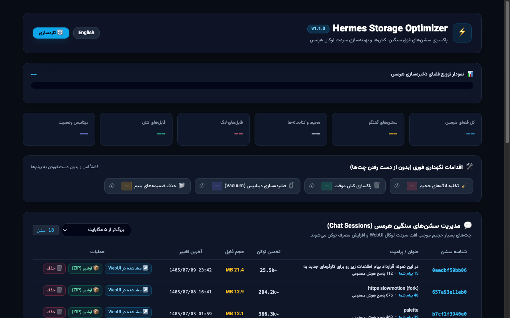

<p align="center">
  
</p>

<div align="center">

[](https://devsponsors.github.io)
[](https://devsponsors.github.io)
[](LICENSE)

**English** • [راهنمای فارسی (Persian)](README.fa.md)

</div>

> ⚡ **Hermes Storage Optimizer**: Lightweight, zero-dependency storage cleaner, session analyzer, and interactive local Web Wizard for **Hermes Agent**.

---

## 🌟 Why Hermes Storage Optimizer?

Continuous workflows with autonomous AI agents like Hermes generate large volumes of chat logs, media uploads, and SQLite database writes under `~/.hermes`. Over time, this leads to:
1. **Slow WebUI Loading:** Loading dozens of multi-megabyte (or gigabyte) session files causes noticeable UI latency.
2. **Context Bloat & Token Waste:** Runaway sessions send oversized conversation histories back to LLM providers, driving up token costs and slowing generation speed.
3. **Wasted Disk Space:** Forgotten logs (`webui.log`), un-vacuumed SQLite databases, and orphaned image assets consume unnecessary gigabytes.

**Hermes Storage Optimizer** provides complete visibility and safe, 1-click remediation with zero external dependencies.

---

## 📸 Web Dashboard Preview

<div align="center">
  
</div>

---

## 🛡️ Key Features

### 1. 📊 Visual Storage Distribution
Real-time, color-coded visual breakdown of disk consumption across chat sessions, python virtualenv (`hermes-agent`), SQLite database, logs, caches, and media attachments.

### 2. 🛠️ Safe Maintenance Suite (Zero Chat Loss)
Each action displays exact reclaimable disk space alongside an informative **ⓘ** tooltip:
- **🧹 Safe Log Truncation:** Zeroes bloated log files (`webui.log`, `logs/*.log`) without crashing running gateway or WebUI processes.
- **🗑️ Cache Cleaner:** Purges transient voice files (Whisper transcripts) and temporary model buffers.
- **🗜️ SQLite Defragmentation (VACUUM):** Runs `VACUUM` on `state.db` to reclaim fragmented free pages back to the filesystem.
- **📁 Orphaned Attachments Cleaner:** Scans `webui/attachments` and eliminates leftover media directories whose parent chat sessions were previously deleted.

### 3. 💬 Heavy Session Manager & Token Analytics
- **Size Filtering:** Instant filtering for sessions over 5 MB, 20 MB, or 100+ MB.
- **Conversation Metrics:** Displays user prompt count vs. AI assistant response count.
- **Token Estimation:** Intelligent context token usage estimate (`~k tokens`) to pinpoint costly sessions.
- **Bilingual & Persian Jalali Dates:** Full solar Hijri (Jalali) date formatting in Persian mode, standard ISO dates in English mode.
- **1-Click WebUI Deep-Link:** Direct button (`↗️`) to inspect the actual conversation in Hermes WebUI before deletion.
- **1-Click Backup Export:** Download complete standalone `.zip` archives containing the session JSON and all associated attachments.

---

## ⚡ Quick Start

### Option 1: Web Wizard (Recommended)
Zero installation required. Simply launch:
```bash
python3 main.py --ui
```
Your browser will automatically open `http://127.0.0.1:9123`.

### Option 2: CLI Inspection
```bash
python3 main.py
```

### Option 3: Direct Automated Cleaning
```bash
# Truncate logs
python3 main.py --clean-logs

# Purge cache
python3 main.py --clean-cache

# Vacuum SQLite DB
python3 main.py --vacuum

# Clean orphaned attachments
python3 main.py --clean-orphaned
```

---

## 🔒 Security & Privacy
- **100% Offline & Local:** No analytics, no outbound network requests.
- **Zero Token/Credential Leakage:** Never reads or logs API keys, tokens, or configuration secrets.

---

## License
Open-sourced under the **MIT License**.
